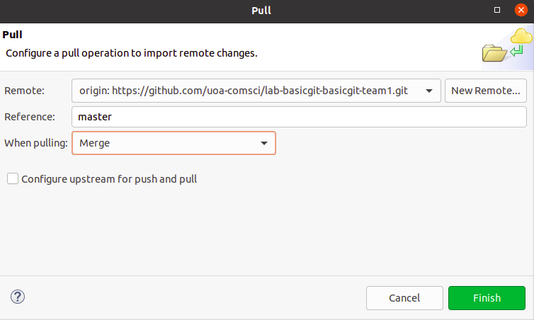
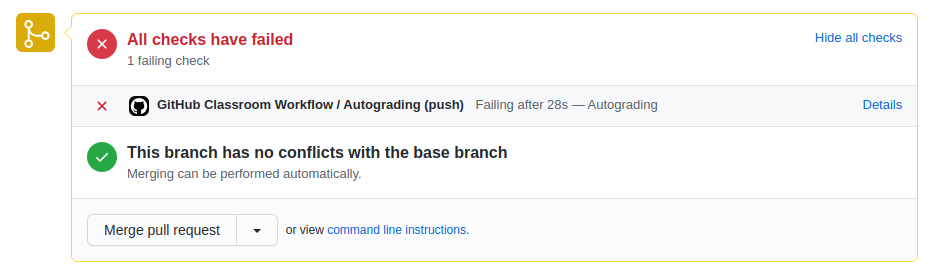
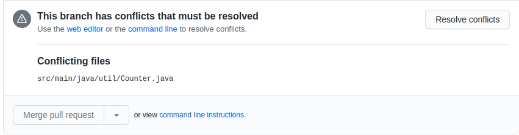

Lab - Git
======================

This lab explores the use of git (and GitHub) by a team. It assumes you are already familiar with the basics of git. Make sure to look at the details of assessment at the end of this file. You will need to set up your teams. This process is described [here](JoiningTeams.md)      

Issues arise when multiple people use the same git repository. The exercises in the lab explore some of them. It assumes you are working in a team of 3, consisting of team members Dev1, Dev2, and Dev 3.

## Exercise 1 - Basic Git

For this exercise the three team members will individually complete the tasks
below to fix faults in their own copy of the repository. The issue is then how
to combine all of the changes into a single version on the remote repository.

***Task 1: Increment Fix***
Fix the faulty in Counter increment(). All code changes and relevant commits must be performed on the master branch.

***Task 2: Decrement Fix***
Fix the faulty in Counter decrement(). All code changes and relevant commits must be performed on the master branch.

***Task 3: Reset Fix***
Fix the faulty in Counter reset(). All code changes and relevant commits must be performed on the master branch.

Each team member makes the change, commits it to their local repository (of
course making meaningful comment messages!) and then attempt to push the
changes to the remote repository. The first one should work without problems,
but for the second and third, the local repositories are now out of date with
respect to the remote repository. Note that all of this should be done on a
the master branch. Using separate brances is in a later exercise.

<ol>
  <li>Dev1,2,3 - clone the project to the local repository. Doing this
  in Eclipse as follows (note that use of Eclipse is not required):
  		<ul>
  			<li>import as a project from Git</li>
  			<li>Right click on project, Configure > Convert to Maven project</li>
  			<li>Run the project with package goal, all tests should fail</li>
  		</ul>
  <li>Dev1,2,3 - performs tasks 1, 2 and 3 (below) respectively on their own local source code</li>
  <li>Dev1 - stage, commit and push the changes for task 1</li>
  <li>Dev2 - perform code synchonisation as explained below and push the changes for task 2</li>
  <li>Dev3 - perform code synchonisation as explained below and push the changes for task 3</li>
</ol>

#### Continuous Integration ####

In COMPSCI331 we will be using the continuous integration (CI) features of
GitHub. Basically this means that whenever you push something to your
repository, some tests will be run. You will receive email summarising the
results of the tests. The results are also available on GitHub. Further
information about CI are below and more will be provided in later labs. For
now, just be aware that any push (even if you are not changing code) will
cause the tests to be run and email sent to you.

#### Code Synchonisation

When Dev2 and Dev3 try to commit and push their changes, the push should be fail and show the error as shown in the figure below (Eclipse). This is because dev1 has already push the source code to Git so the source code that Dev2 and Dev3 is not in sync with the code on the remote repository. Github does not allow you to push the source code for this reason and therefore give the rejected message.


"non-fast-forward" is a complicated way to say that there is a newer version of the file being pushed on the remote repository, probably because someone else has changed the file and pushed it to the remote repository. The command line message is slightly more useful:

```
! [rejected]        master -> master (non-fast-forward)
error: failed to push some refs to 'https://github.com/COMPSCI331-2021/lab-git.git'
hint: Updates were rejected because the tip of your current branch is behind
hint: its remote counterpart. Integrate the remote changes (e.g.
hint: 'git pull ...') before pushing again.
hint: See the 'Note about fast-forwards' in 'git push --help' for details.
```

Note the comment about <tt>git pull...</tt>, and you can ignore the
"fast-forwards" hint.

What Dev2 and Dev3 now need to do (first one, then the other, otherwise the
same problem will occur) is perform a 'pull to merge'. This is done by issuing
a "pull" either through the IDE or command line (<tt>git pull</tt>).

From Eclipse, ensure "Merge" is selected when doing the merge.



From the command line when you do the command you will see something like:
```
Auto-merging filethatwaschanged.txt
CONFLICT (content): Merge conflict in filethatwaschanged.txt
Automatic merge failed; fix conflicts and then commit the result.
```

Now the file affected (in this case <tt>filethatwaschanged.txt</tt>) will have both sets of changes. When the <tt>pull</tt> is done (really the <tt>merge</tt> that is parge of the <tt>pull</tt>), the two sets of changes are merged into the file, with annotations to show which is which. This will be shown in the file with something like:

```
<<<<<<< HEAD
one set of changes
=======
the other set of changes
>>>>>>> master
```

What the dev needs to do is figure out how to integrate these two sets of
changes, generally referred to as resolving the conflict. How this is done depends on exactly what the changes are. The
main thing is that the annotations (<tt>&lt;&lt;&lt;&lt;&lt;&lt;&lt;</tt>,
<tt>&gt;&gt;&gt;&gt;&gt;&gt;&gt;</tt>,
<tt>======</tt>) have to be removed. For example:
```
the other set of changes
one set of changes
```
In this case the decision was made alter the order the changes appear in the
file. Now the file can be committed and pushed to the remote repository.

Once both Dev2 and Dev3 have resolved the conflicts this exercise is complete. 

## Exercise 2 - Git Branches

For this exercise, the three developers will again make three changes (this time adding features), but this time on different branches. 
**Before starting this exercise, please make sure that all three developers pull the latest source code from the repository.**

Feature 1 by Dev1 is to implement the increment method **incrementToEven()** that increases the counter to the next even number. implement the decrement method **decrementToEven()** that decrease the counter the previous even number.

Feature 2 by Dev2 is to implement the increment method **incrementToPrime()** that increases the counter to the next prime number. implement the decrement method **decrementToPrime()** that decrease the counter the previous prime number.

Feature 3 by Dev3 is to implement the **countFrequency()** method. This method count the number of word in the given sentence. Also, you must refactor the code implemented by dev1 and dev2. The code refactoring should improve the overall quality of source code such as getting rid of replicate code, apply the standard code convention, etc.

#### Development Process

Each dev works on these features on three separately branches namely feature1, feature2 and feature3 before merging them into the master branch. The overall process is:

<ol>
  <li>Dev1,2,3 - clone the project to local repository</li>
  <li>Dev1,2,3 - implement feature 1, 2 and 3 respectively locally</li>
  <li>Dev1 - stage, commit and push changes on the feature1 branch</li>
  <li>Dev2 - stage, commit and push changes on the feature2 branch</li>
  <li>Dev3 - stage, commit and push changes on the feature3 branch</li>
  <li>Dev1,2,3 - create a pull request to merge from their own branch to the master branch</li>
  <li>team leader approves the pull requests</li>
</ol>

#### New Branch, Build and Test

Each dev needs to create a branch for the feature they are implementing as named above. Creating a branch from the command line is done with:
```
prompt> git branch feature1
```
In Eclipse, you can create a new branch by going to Team > switch To > New
Branch.

Once you have made the changes needed, commit them.  Make sure you are on your
own branch before making a commit.

There are three test scripts in place namely TestFeature1, TestFeature2 and TestFeature3 for testing each feature.  You can test only a feature on your branch by put in goal in maven as **-Dtest=<test script> test**. For example, **-Dtest=TestFeature1 test** is for testing feature 1.

After you commit source code on your branch, github classroom workflow will be executed to test your code. Please make sure your code on the branch passes designated test. The figure below shows the log file (it also can be accessed from Github's Actions tab) after Dev1 has commited on feature1 branch; testfeature1 is success, while testfeature2 and testfeature3 fails. Similarly, the execution of feature2 branch should have testfeature2 sucess, while testfeature1 and testfeature3 fails.  


There are a number of tutorials available on-line. A reasonable one
(although with more detail than needed for this lab) is by [Atlassian](https://www.atlassian.com/git/tutorials/using-branches)

#### Pull Request
The implementation of new features are separately stored on different branches. In order to combine all implementations, we need to merge the source from feature1-3 branches into the master branch. To achieve this, we create pull requests on Github by going to Pull Request tab and click new pull request button. Then, select the branch to merge into master branch, Github will show the comparison of files on master branch and feature branch as the figure below.


If there is no conflict in the file, the branches can be automatically merged. However, if there is any conflict, the developer must resolve it when approving the pull request. In this case, you can click on create pull request button and enter the message of this pull request for later approval.



On the approval as the figure above shown, Github informs us that there is no conflict so we can choose to merge the pull request. However, if there is conflict as sample shown below, you must resolve the conflict before you can merge it into the master.





After that, the implementation of the feature will be added into the master branch. You have to repeat the same process to merge all three features into the master branch.
  
<h2>Build & Run project on GitHub</h2>
To see the result of building and running test on Github, you can click on Action tab. GitHub Action is CI-CD pipeline provided by GitHub. It is similar to other CI-CD pipeline platform e.g. Travis CI, Jenkins etc. In this project, there is a workflow already defined namely Github Classroom, as shown in the figure below. This workflow is used for auto grading purpose. Every time you push the code on your repository, this workflow will be queued to execute automatically. You have to ensure that after your team made the last commit to combine all features and resolve all conflicts, the execution of this workflow runs successfully without any error (as the figure below show the success execution of last run). 


<h2>Assessment</h2>

The marking of this lab will be based on your team repository as of Friday 19
March 1700hrs. As well as the changes made to it for the above exercises, you
must include a file <tt>Team.md</tt> containing the list of members in your
team and a brief summary of what role each member played. For example:

* Ewan - Dev1 in exercise 1, Dev3 in exercise 2
* Paramvir - Dev3 in exercise 1, Dev2 in exercise 2
* Nacha - Dev2 in exercise 1, Dev1 in exercise 1

If this file is not provided then there will be a 50% penalty.

Assessment will be performed by examining the commit logs and other
information associated with your team repository.  You must demonstrate that
you have engaged with the lab material and fully participated with the
team. This means we expect to see non-trivial commits, with meaningful commit
messages, corresponding to each exercise. Different team members will do
different things and different times, but we will be looking for evidence that
there was cooperation and collaboration.
