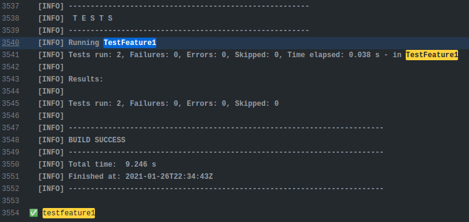
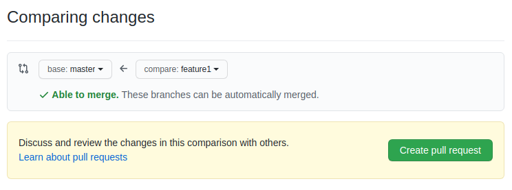
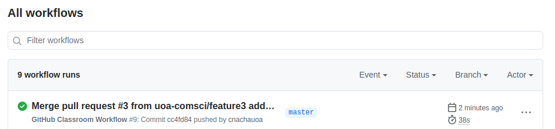

Lab - Git
======================
Experimenting Going with ewan's local

This lab explores the use of git (and GitHub) by a team. It assumes you are already familiar with the basics of git.

Issues arise when multiple people use the same git repository. The exercises in the lab explore some of them. It assumes you are working in a team of 3, consisting of team members Dev1, Dev2, and Dev 3.

## Exercise 1 - Basic Git

For this exercise the three team members will individually make changes fix
faults in their own copy of the repository. The issue is then how to combine
all of the changes into a single version on the remote repository.

Each team member makes the change, commits it to their local repository (of
course making meaningful comment messages!) and then attempt to push the
changes to the remote repository. The first one should work without problems,
but for the second and third, the local repositories are now out of date with
respect to the remote repository. Note that all of this should be done on a
the master branch. Using separate brances is in a later exercise.

<ol>
  <li>Dev1,2,3 - clone the project to the local repository. Doing this
  in Eclipse as follows (note that use of Eclipse is not required):
  		<ul>
  			<li>import as a project from Git</li>
  			<li>Right click on project, Configure > Convert to Maven project</li>
  			<li>Run the project with package goal, all tests should fail</li>
  		</ul>
  <li>Dev1,2,3 - performs tasks 1, 2 and 3 (below) respectively on their own local source code</li>
  <li>Dev1 - stage, commit and push the changes for task 1</li>
  <li>Dev2 - perform code synchonisation as explained below and push the changes for task 2</li>
  <li>Dev3 - perform code synchonisation as explained below and push the changes for task 3</li>
</ol>

***Task 1: Increment Fix***
Fix the faulty in Counter increment(). All code changes and relevant commits must be performed on the master branch.

***Task 2: Decrement Fix***
Fix the faulty in Counter decrement(). All code changes and relevant commits must be performed on the master branch.

***Task 3: Reset Fix***
Fix the faulty in Counter reset(). All code changes and relevant commits must be performed on the master branch.

#### Code Synchonisation

When Dev2 and Dev3 try to commit and push their changes, the push should be fail and show the error as shown in the figure below (Eclipse). This is because dev1 has already push the source code to Git so the source code that Dev2 and Dev3 is not in sync with the code on the remote repository. Github does not allow you to push the source code for this reason and therefore give the rejected message.
("non-fast-forward" is a complicated way to say that there is a newer version of the file being pushed on the remote repository, probably because someone else has changed the file and pushed it to the remote repository).


After you receive this rejection, you have to perform 'pull to merge' operation. This operation will combine the source code from the remote repository to your repository. Then, resolve any conflict if there is any and push the source code again. 


## Exercise 2 - Git Branches
In this lab exercise, we will demonstrate how branch can be created on Git. Three developers namely dev1, dev2 and dev3 must add three different features on the Counter program.  

Feature 1 by Dev1 implement the increment method **incrementToEven()** that increases the counter to the next even number. implement the decrement method **decrementToEven()** that decrease the counter the previous even number.

Feature 2 by Dev2 - implement the increment method **incrementToPrime()** that increases the counter to the next prime number. implement the decrement method **decrementToPrime()** that decrease the counter the previous prime number.

Feature 3 by Dev3 - implement the **countFrequency()** method. This method count the number of word in the given sentence. Also, you must refactor the code implemented by dev1 and dev2. The code refactoring should improve the overall quality of source code such as getting rid of replicate code, apply the standard code convention, etc.

#### Development Process
Your team must work on these features on three separately branches namely feature1, feature2 and feature3 before merging them into the master branch. The following steps guide you on the overall process of this development.

<ol>
  <li>Dev1,2,3 - clone the project to local repository using Eclipse</li>
  <li>Dev1,2,3 - implement feature 1,2 and 3 respectively on their own local source code</li>
  <li>Dev1 - stage, commit and push your changes on feature1 branch</li>
  <li>Dev2 - stage, commit and push your changes on feature2 branch</li>
  <li>Dev3 - stage, commit and push your changes on feature3 branch</li>
  <li>Dev1,2,3 - create a pull request to merge from their own branch to the master branch</li>
  <li>team leader approves the pull requests</li>
</ol>

#### New Branch, Build and Test
On Eclipse, you can create a new branch by going to Team > switch To > New Branch. Make sure you are on your own branch before making a commit. There are three test scripts in place namely TestFeature1, TestFeature2 and TestFeature3 for testing each feature.  You can test only a feature on your branch by put in goal in maven as **-Dtest=<test script> test**. For example, **-Dtest=TestFeature1 test** is for testing feature 1.

After you commit source code on your branch, github classroom workflow will be executed to test your code. Please make sure your code on the branch pass designated test. The figure below show the log file (can be accessed from Github's Actions tab) after dev1 commit on feature1 branch; testfeature1 is success, while testfeature2 and testfeature3 fails. Similarly, the execution of feature2 branch should have testfeature2 sucess, while testfeature1 and testfeature3 fails.  




#### Pull Request
The implementation of new features are separately stored on different branches. In order to combine all implementations, we need to merge the source from feature1-3 branches into the master branch. To achieve this, we create pull requests on Github by going to Pull Request tab and click new pull request button. Then, select the branch to merge into master branch, Github will show the comparison of files on master branch and feature branch as the figure below.



If there is no conflict in the file, the branches can be automatically merged. However, if there is any conflict, the developer must resolve it when approving the pull request. In this case, you can click on create pull request button and enter the message of this pull request for later approval.


On the approval as the figure above shown, Github informs us that there is no conflict so we can choose to merge the pull request. However, if there is conflict as sample shown below, you must resolve the conflict before you can merge it into the master.


After that, the implementation of feature will be added into the master branch. You have to repeat the same process to merge all three features into the master branch.
  
<h2>Build & Run project on GitHub</h2>
To see the result of building and running test on Github, you can click on Action tab. GitHub Action is CI-CD pipeline provided by GitHub. It is similar to other CI-CD pipeline platform e.g. Travis CI, Jenkins etc. In this project, there is a workflow already defined namely Github Classroom, as shown in the figure below. This workflow is used for auto grading purpose. Every time you push the code on your repository, this workflow will be queued to execute automatically. You have to ensure that after your team made the last commit to combine all features and resolve all conflicts, the execution of this workflow runs successfully without any error (as the figure below show the success execution of last run). 




<h2>Answer the following questions</h2>
<ul>
  <li>What is different between fetch and pull?</li>
  <li>Can you define a new CI-CD workflow to run a specific test such as testMultiplyBy?</li>
</ul>
Note your answers here, and in your journal.

```
Your answers here.
```
